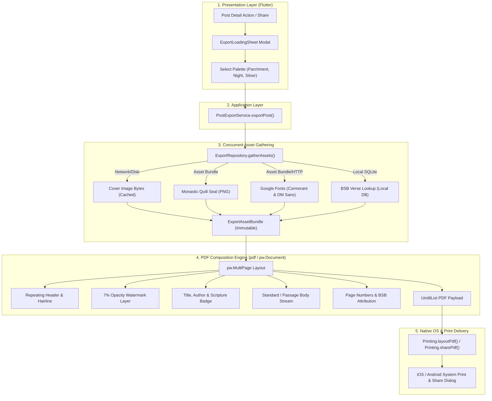

# Scribes — Export Feature Technical Flow & Architecture

The **Scribes Export Pipeline** transforms digital reflections and sacred posts into archival-grade, beautifully typeset **Illuminated PDF Manuscripts**, as well as structured **Markdown** and **Plaintext** documents.

---

## 1. High-Level Architecture Overview

The system divides export responsibilities across **Client-Side In-Memory PDF Rendering** and **Backend Document Serialisation**:

---

## 2. End-to-End Execution Sequence

```mermaid
sequenceDiagram
    autonumber
    actor User
    participant UI as PostDetailScreen / ExportLoadingSheet
    participant Service as PostExportService
    participant Repo as ExportRepository
    participant BSB as BibleRepository (Local SQLite)
    participant PDF as pw.Document (pdf Canvas)
    participant OS as Printing (Platform Bridge)

    User->>UI: Tap "Export PDF"
    UI->>UI: Open Modal (Parchment, Night, or Silver selection)
    User->>UI: Select Theme & Confirm
    UI->>Service: exportPost(post, theme, preview: true)

    rect rgb(28, 28, 35)
        Note over Service,Repo: Step 1: Async Concurrent Gathering (Zero-Jank)
        Service->>Repo: gatherAssets(post, theme)
        par Cover Image
            Repo->>Repo: Download/Cache cover image bytes
        and Watermark
            Repo->>Repo: Load 'assets/branding/scribes_mark.png'
        and Scripture
            Repo->>BSB: Query verse range from local SQLite
            BSB-->>Repo: Verse texts & translation tag
        and Typography
            Repo->>Repo: Load Cormorant Garamond & DM Sans TTFs
        end
        Repo-->>Service: Return ExportAssetBundle
    end

    rect rgb(25, 32, 28)
        Note over Service,PDF: Step 2: Document Tree Compilation
        Service->>PDF: Initialize pw.Document(theme, metadata)
        Service->>PDF: Build pw.MultiPage(margin: 40pt)
        PDF->>PDF: Layer background watermark (7% opacity)
        PDF->>PDF: Build running header (wordmark + hairline)
        PDF->>PDF: Format Title Block, Tags, Scripture Badges
        PDF->>PDF: Stream delta rich text / passage panels
        PDF->>PDF: Build running footer with BSB legal attribution
        PDF-->>Service: Compile Uint8List binary bytes
    end

    rect rgb(35, 28, 28)
        Note over Service,OS: Step 3: Platform Delivery
        Service->>OS: Printing.layoutPdf(bytes, name: post.title)
        OS-->>User: Open Native OS Print Preview / Share Sheet
        Service-->>UI: Dismiss modal & notify success
    end
```

---

## 3. Core Component Inventory

| Component | Path | Responsibility |
|---|---|---|
| **Service** | [`post_export_service.dart`](file:///client/lib/features/export/application/post_export_service.dart) | Orchestrates lifecycle: Gathering → Document Compilation → OS Native Delivery. |
| **Repository** | [`export_repository.dart`](file:///client/lib/features/export/data/export_repository.dart) | Gathers remote cover images, loads asset watermarks, queries local BSB SQLite, and pre-fetches TTF typography. |
| **Data Model** | [`export_asset_bundle.dart`](file:///client/lib/features/export/domain/export_asset_bundle.dart) | Immutable container holding resolved image bytes, font data, and scripture text. |
| **Theme Bridge** | [`pdf_theme.dart`](file:///client/lib/features/export/presentation/pdf/pdf_theme.dart) | Converts runtime Flutter `ScribesColors` into `pw.PdfColor` for Parchment, Night, and Silver palettes. |
| **Watermark** | [`pdf_watermark.dart`](file:///client/lib/features/export/presentation/pdf/pdf_watermark.dart) | Draws the monastic quill mark at exactly 7% opacity behind text on every page. |
| **Header** | [`pdf_header.dart`](file:///client/lib/features/export/presentation/pdf/pdf_header.dart) | Repeating top wordmark, post category tag, and 0.5pt gold hairline divider. |
| **Footer** | [`pdf_footer.dart`](file:///client/lib/features/export/presentation/pdf/pdf_footer.dart) | Dynamic pagination (`Page X of Y`) and Berean Standard Bible (BSB) public domain legal attribution. |
| **Body Builders** | [`pdf_body_standard.dart`](file:///client/lib/features/export/presentation/pdf/pdf_body_standard.dart) | Standard post rich-text and inline scripture quotation cards. |
| **UI Trigger** | [`export_loading_sheet.dart`](file:///client/lib/features/export/presentation/export_loading_sheet.dart) | Glassmorphic bottom sheet presenting theme choices and generation progress. |

---

## 4. Key Architectural Guarantees

1. **Deterministic Pagination**: Uses `pw.MultiPage` so that long articles, scripture quotes, and reflections naturally flow across page breaks without manual coordinate math.
2. **Offline-First Scripture Guarantee**: Verse text is retrieved from the on-device SQLite database (`bsb.sqlite3`), requiring **zero network connectivity** for scripture verification during PDF generation.
3. **Typography & Layout Consistency**: Embedded TrueType fonts guarantee that the exported manuscript looks identical on iOS, Android, macOS, Windows, or Linux printers.
