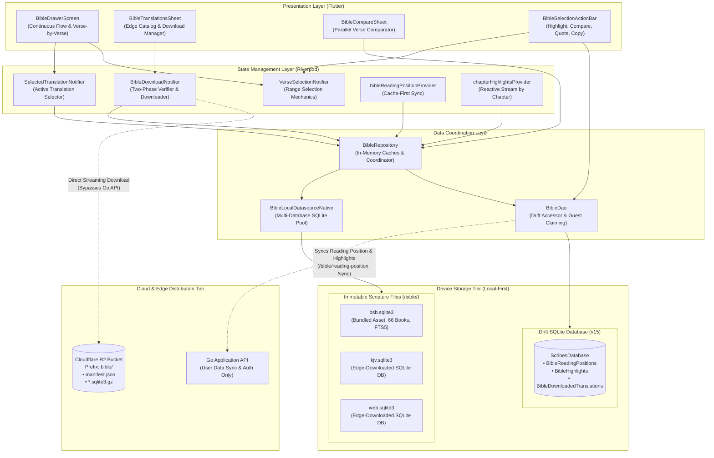
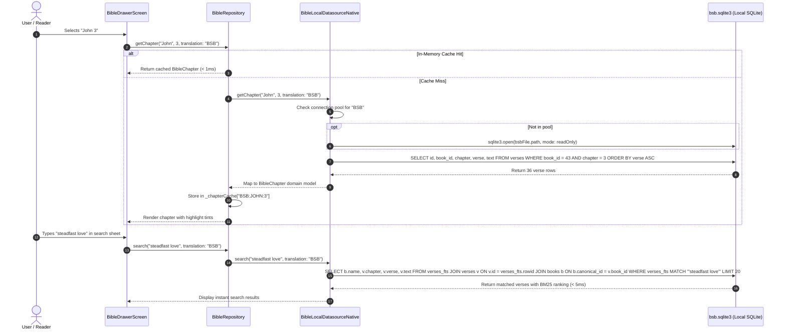
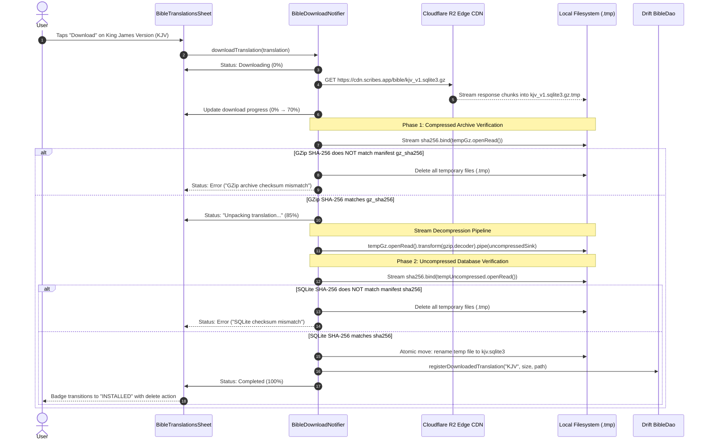
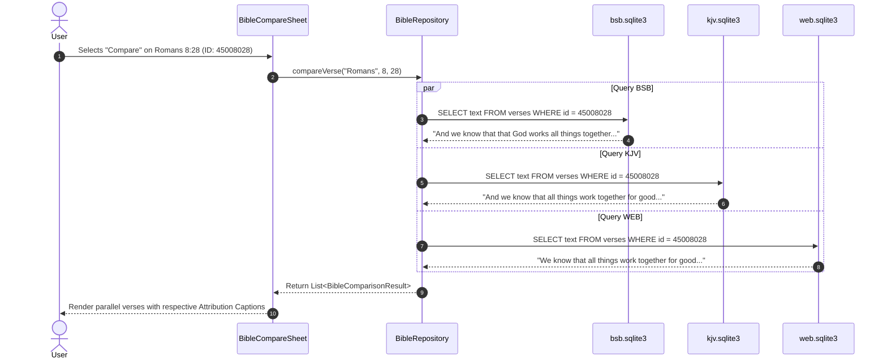

# Scribes Bible System — Complete Architecture & Operational Guide
**Version 4.0 · Local-First Scripture Engine, Edge Distribution & Decoupled User Sync**

---

## 1. Executive Summary & Core Philosophy

The Scribes Bible System is a decentralized, local-first scripture engine built to ensure zero network latency, unconditional offline reading, and absolute separation between immutable sacred text and mutable user annotations.

Unlike traditional Bible platforms that stream scripture verse-by-verse over HTTP REST endpoints, Scribes implements a **Zero-API Scripture Read Path**:
- Scripture chapters, verses, books, and full-text keyword searches execute **100% locally** against vacuumed, pre-indexed SQLite databases on the user's device.
- Additional translations are distributed as pre-packaged, compressed SQLite artifacts directly from static CDN edge storage (**Cloudflare R2**), completely bypassing dynamic application servers.
- User data (reading positions, highlights, and downloaded translation metadata) is completely decoupled from immutable scripture files, residing in the reactive local application database (**Drift SQLite**) and syncing asynchronously with the backend.

---

## 2. Real-World Analogy

> **Think of it like a public reference library and your personal reading journal:**
> The library shelves hold timeless, bound volumes of scripture (the edge-distributed SQLite translation databases). You never ask the head librarian to read you every sentence over a spotty telephone line (avoiding dynamic REST APIs), nor do you write ink notes directly into the rare library books. Instead, you keep your personal bookmarks and highlights in your own pocket notebook (the Drift SQLite database). If you want an additional translation on your shelf, you check out a copy once from the central repository (Cloudflare R2 edge download), verify its tamper-evident wax seal (`gz_sha256`) and publication imprint (`sha256`), and keep it permanently on your shelf for instant, lifelong offline study.

---

## 3. Architecture & Performance Invariants

| Invariant | System Rule | Technical Implementation |
|---|---|---|
| **Zero-API Read Path** | Bible text, chapters, books, and searches must **NEVER** be queried from backend application servers. | All text reads and FTS5 keyword searches resolve against local SQLite databases (`<code_lower>.sqlite3`) via `sqlite3` C-bindings in Dart. |
| **Edge-Distributed Artifacts** | Binary translation databases must **NEVER** be served by dynamic Go API handlers. | Packaged as vacuumed SQLite artifacts, compressed with Gzip, and uploaded to Cloudflare R2 bucket with static CDN caching. |
| **Two-Phase Checksum Verification** | Downloaded translation files must be cryptographically validated before and after decompression. | **Phase 1:** Stream verifies `gz_sha256` of archive. **Phase 2:** Verifies `sha256` of uncompressed database before mounting or registering in Drift. |
| **Multi-Version File Isolation** | Translations must remain physically isolated files without schema coupling. | Each translation is an independent `<code_lower>.sqlite3` file. Adding or deleting a translation is an atomic filesystem operation. |
| **Universal Canonical Coordinates** | All scripture coordinates must be uniform across all versions and languages. | Integer coordinate: $\text{ID} = (\text{book\_id} \times 1{,}000{,}000) + (\text{chapter} \times 1{,}000) + \text{verse}$. Resolves instantly in-memory across translation databases. |
| **Decoupled User Storage** | User annotations must never reside in scripture translation databases. | Highlights and reading positions reside in Drift (`ScribesDatabase` v15), syncing via `/bible/reading-position` and `/sync/push`. |
| **Guest Offline Creation & Re-parenting** | Unauthenticated guests must have full reading and highlighting capabilities. | Guest operations persist locally using a secure device ID. An atomic Drift transaction re-parents all records to `userId` upon login or registration. |
| **Attribution Guarantee** | Wherever scripture verse text is rendered, translation attribution must be visibly displayed. | Dynamic attribution captions rendered in reader footers, comparison sheets, and share previews. |

---

## 4. End-to-End System Topology



---

## 5. Detailed Component Workflows

### 5.1. Zero-API Scripture Read & Sub-Millisecond Search



---

### 5.2. Edge Translation Download & Two-Phase Verification



---

### 5.3. Universal Canonical Coordinates & Parallel Verse Comparison

All Bible translations share a standard canonical coordinate formula that encodes book, chapter, and verse into a single 32-bit integer:

$$\text{Canonical ID} = (\text{Book Number} \times 1{,}000{,}000) + (\text{Chapter Number} \times 1{,}000) + \text{Verse Number}$$

For example, **John 3:16** is universally represented across all translations as:
$$\text{ID} = (43 \times 1{,}000{,}000) + (3 \times 1{,}000) + 16 = 43003016$$



---

### 5.4. Guest Account Claiming (Re-Parenting Flow)

When an unauthenticated guest user creates reading positions or highlights, the data is saved locally using a persistent device-level guest ID. When they subsequently register or log in, Scribes executes an atomic Drift transaction to re-parent the data:

```mermaid
sequenceDiagram
    autonumber
    actor Guest as Unauthenticated Guest
    participant App as Scribes App
    participant Drift as Drift ScribesDatabase
    participant Server as Cloudflare / Go API

    Guest->>App: Reads John 3, highlights verse 16
    App->>Drift: saveHighlight(userId: "guest_uuid", book: "JHN", chapter: 3, verse: 16, isSynced: false)
    App->>Drift: saveReadingPosition(userId: "guest_uuid", book: "JHN", chapter: 3, verse: 16, isSynced: false)

    Guest->>App: Completes Signup / Login (receives auth userId: "usr_abc123")
    App->>Drift: reparentGuestData(guestId: "guest_uuid", newUserId: "usr_abc123")
    
    rect rgb(30, 40, 30)
        Note over Drift: Atomic Drift Transaction
        Drift->>Drift: UPDATE bible_highlights SET user_id = 'usr_abc123', is_synced = false WHERE user_id = 'guest_uuid'
        Drift->>Drift: UPDATE bible_reading_positions SET user_id = 'usr_abc123', is_synced = false WHERE user_id = 'guest_uuid'
    end

    App->>Server: Trigger Cloud Sync (/sync/push or /bible/reading-position)
    Server-->>App: Acknowledge sync (HTTP 200)
    App->>Drift: Mark records isSynced = true
```



---

## 6. Schemas & Data Models

### 6.1. Scripture Translation SQLite Schema (v2)

Each translation file (`<code_lower>.sqlite3`) contains:

```sql
-- 1. Translation Metadata
CREATE TABLE translation_meta (
    code           TEXT PRIMARY KEY,
    name           TEXT NOT NULL,
    language       TEXT NOT NULL DEFAULT 'en',
    attribution    TEXT NOT NULL,
    schema_version INTEGER NOT NULL DEFAULT 2
);

-- 2. Canonical Books Catalog
CREATE TABLE books (
    canonical_id  INTEGER PRIMARY KEY,  -- 1 to 66
    code          TEXT NOT NULL UNIQUE,  -- 'GEN', 'EXO', 'JHN', 'REV'
    name          TEXT NOT NULL,         -- 'Genesis', 'John'
    short_name    TEXT NOT NULL,         -- 'Gen', 'Jn'
    testament     TEXT NOT NULL,         -- 'OT' or 'NT'
    book_order    INTEGER NOT NULL,      -- 1 to 66
    chapter_count INTEGER NOT NULL
);

-- 3. Canonical Verses Table
CREATE TABLE verses (
    id       INTEGER PRIMARY KEY,         -- Universal Coordinate: 43003016
    book_id  INTEGER NOT NULL REFERENCES books(canonical_id),
    chapter  INTEGER NOT NULL,
    verse    INTEGER NOT NULL,
    text     TEXT NOT NULL
);

-- 4. Full-Text Search (FTS5) Virtual Table & Triggers
CREATE VIRTUAL TABLE verses_fts USING fts5(
    text,
    content='verses',
    content_rowid='id',
    tokenize='porter unicode61'
);

CREATE TRIGGER verses_ai AFTER INSERT ON verses BEGIN
    INSERT INTO verses_fts(rowid, text) VALUES (new.id, new.text);
END;
```

---

### 6.2. User Annotations & Download Registry (Drift Schema v15)

Located in `client/lib/core/storage/drift_database.dart`:

```dart
class BibleReadingPositions extends Table {
  TextColumn get userId => text()();
  TextColumn get bookCode => text()();
  IntColumn get chapter => integer()();
  IntColumn get verse => integer()();
  TextColumn get preferredTranslation => text().withDefault(const Constant('BSB'))();
  DateTimeColumn get updatedAt => dateTime()();
  BoolColumn get isSynced => boolean().withDefault(const Constant(false))();

  @override
  Set<Column> get primaryKey => {userId};
}

class BibleHighlights extends Table {
  TextColumn get id => text()();
  TextColumn get userId => text()();
  TextColumn get bookCode => text()();
  IntColumn get chapter => integer()();
  IntColumn get verse => integer()();
  TextColumn get colorHex => text().withDefault(const Constant('C9A84C'))();
  DateTimeColumn get createdAt => dateTime()();
  BoolColumn get isSynced => boolean().withDefault(const Constant(false))();

  @override
  Set<Column> get primaryKey => {id};
}

class BibleDownloadedTranslations extends Table {
  TextColumn get code => text()();
  TextColumn get name => text()();
  TextColumn get localPath => text()();
  IntColumn get version => integer()();
  IntColumn get sizeBytes => integer()();
  BoolColumn get isDefault => boolean().withDefault(const Constant(false))();
  DateTimeColumn get installedAt => dateTime()();

  @override
  Set<Column> get primaryKey => {code};
}
```

---

## 7. Operational Playbook

### 7.1. Packaging a New Translation
To package and compress a translation into static edge distribution artifacts:

```bash
# Run packaging script for a target translation (e.g. KJV)
python scripts/package_bible_translation.py --translation KJV --output-dir dist/bible
```
This script:
1. Validates SQLite schema invariants (66 canonical books, 31,000+ verses, FTS5 virtual table).
2. Executes `VACUUM` and `ANALYZE` to optimize SQLite page allocation.
3. Computes the uncompressed SHA-256 digest (`sha256`).
4. Compresses the database with `gzip` (maximum compression level 9).
5. Computes the archive SHA-256 digest (`gz_sha256`).
6. Updates `dist/bible/manifest.json`.

---

### 7.2. Publishing to Live Cloudflare R2
To publish the packaged artifacts directly to the production Cloudflare R2 edge bucket:

```bash
# Uses environment variables: R2_ENDPOINT, R2_ACCESS_KEY_ID, R2_SECRET_ACCESS_KEY, R2_BUCKET
cd backend
go run ./cmd/publish-bible
```
The publisher tool:
- Scans `dist/bible/`.
- Uploads `manifest.json` with `Content-Type: application/json`.
- Uploads `*.sqlite3.gz` artifacts with `Content-Type: application/gzip` (**never** `Content-Encoding: gzip`).
- Ensures artifacts are instantly available through Cloudflare edge caching.

---

### 7.3. Running Verification Tests

```powershell
# 1. Bible Download Service Suite (5 tests)
flutter test test/bible_download_service_test.dart

# 2. Local SQLite Engine & FTS5 Suite (5 tests)
flutter test test/bible_local_engine_test.dart

# 3. Decoupled User Data & Drift DAO Suite (5 tests)
flutter test test/bible_user_data_test.dart

# 4. Full Flutter Client Suite (42 tests)
flutter test

# 5. Static Code Analysis
flutter analyze lib

# 6. Go Backend Test Suite
cd backend; go test ./...
```

---

## 8. Drawbacks & Trade-offs

| Architectural Decision | Chosen Implementation | Alternative Considered | Trade-offs & Limitations |
|---|---|---|---|
| **Multi-Database File Isolation** | Dedicated `.sqlite3` file per translation | Single consolidated multi-translation database | **Pros:** Adding or removing a translation is an atomic filesystem operation (`rm kjv.sqlite3`) with zero database lock contention. **Cons:** Cross-translation parallel comparisons must query multiple SQLite handles in Dart rather than an in-engine SQL `UNION`. |
| **Edge Storage vs. Dynamic API** | Cloudflare R2 static bucket distribution | Dynamic chunked streaming through Go backend | **Pros:** Infinitely scalable, 0 server egress costs, 0 socket congestion on Go backend. **Cons:** Translation catalogs must be synchronized via a static `manifest.json`. |
| **GZip Stream Decompression** | Dart pipeline `openRead().transform(gzip.decoder).pipe(...)` | Background worker thread via `Isolate.run()` | **Pros:** Simple, memory-bounded, zero isolate port messaging overhead. **Cons:** For ~3.9 MB gzipped files (~8.5 MB uncompressed), decompression takes ~70ms on the main event loop. For multi-hundred-megabyte files, an isolate would be mandatory. |

---

## 9. Ground Truth: Documentation & Community Standards
- **Local-First Software Movement:** Matches the [Ink & Switch Local-First Principles](https://www.inkandswitch.com/local-first/): device owns primary data, operations are local, network is auxiliary.
- **SQLite FTS5:** Official SQLite documentation specifies `fts5` with BM25 ranking triggers for sub-millisecond keyword retrieval over canonical corpora.
- **Cloudflare R2 Object Storage:** S3 API compatibility guarantees standard object storage semantics while edge caching provides global low-latency downloads.
