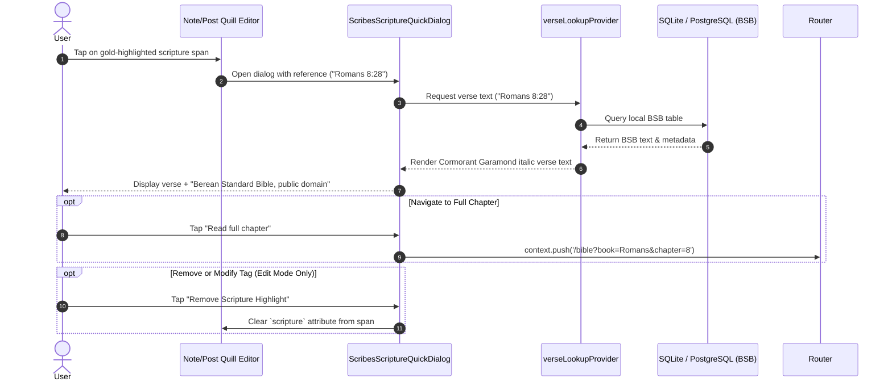

# Feature Engineering Specification: Inline Scripture Golden Highlights

## 1. Architectural Foundations & The "Why"

In note-taking and contemplative theological writing, scripture citations are not merely global tags attached to an entire document—they are **deeply contextual anchors**.

### The Problem with Document-Level Chips
Prior to inline highlighting, scripture references lived in an isolated metadata array at the top or bottom of a note (`scripture_refs: ["John 1:1", "Romans 8:28"]`). This creates cognitive and spatial separation:
1. **Loss of Context:** A reader or writer cannot tell which paragraph, phrase, or commentary relates to which citation without manual cross-referencing.
2. **Visual Clutter:** Having dozens of chip widgets at the top of a long sermon note pushes the actual body text below the viewport fold.
3. **Rigid Structure:** Chips act like file tags rather than living, interactive marginalia woven into the prose.

### The Inline Golden Highlight Solution
By treating scripture citations as **inline text attributes** within the rich-text Document Object Model (Quill Delta), the scripture reference becomes an intrinsic property of the text spans themselves:
- Words, quotations, or references (e.g., *"In the beginning was the Word"* or *"John 1:1"*) glow with a refined gold tint.
- Tapping the highlighted span immediately summons the self-hosted scripture expansion dialog.
- The document's metadata automatically syncs with all inline references for search indexing and feed queries.

---

## 2. Real-World Analogy

> **Think of it like illuminated manuscripts with golden leaf ink.**
> In medieval scriptoriums, scribes did not write sacred verses on separate index cards pinned to the head of a scroll. Instead, when quoting scripture directly within their commentary, they switched to golden ink (*chrysography*) or gilded rubrication directly in the body text. 
> 
> When a scholar glanced at the parchment, the sacred texts immediately stood out with a warm, golden luster, allowing them to instantly touch the illuminated passage and reflect on the divine reference without losing their place in the prose.

---

## 3. Data Representation: Quill Delta Contract

Scribes stores note and draft bodies as **Quill Deltas** (JSON arrays of insert operations). Rather than introducing heavy block-level embeds that break text flow, inline scriptures are represented as a custom inline attribute.

### Quill Delta Structure

```json
[
  { "insert": "Reflecting on creation and the eternal Word:\n" },
  {
    "insert": "In the beginning was the Word, and the Word was with God",
    "attributes": {
      "italic": true,
      "scripture": "John 1:1"
    }
  },
  { "insert": ". This foundational truth reminds us of Christ's pre-eminence as echoed in " },
  {
    "insert": "Colossians 1:16-17",
    "attributes": {
      "scripture": "Colossians 1:16-17"
    }
  },
  { "insert": ".\n" }
]
```

### Key Contract Rules
1. **Attribute Key:** `"scripture"`
2. **Attribute Value:** Canonical scripture reference string formatted as `"<Book> <Chapter>:<VerseStart>[-<VerseEnd>]"` (e.g., `"Genesis 1:1"`, `"Romans 8:28-30"`).
3. **Composability:** The `"scripture"` attribute can coexist alongside formatting attributes (e.g., `bold: true`, `italic: true`, `color: ...`).
4. **Metadata Extraction Pipeline:** When a note or post is saved, the client/backend traverses the Delta's operations, collects unique `attributes.scripture` values, and populates the top-level `scripture_refs` table column for relational indexing (`WHERE scripture_refs @> ARRAY['John 1:1']`).

---

## 4. User Interaction & Input Modalities

To provide an effortless writing experience on mobile and desktop, two intuitive input mechanisms are engineered:

### Method A: Selection & Formatting Bar (Explicit Tagging)
```
[User selects text: "John 3:16"] 
  └──> Taps [Book Icon] in Editor Toolbar
         └──> Scripture Selector Sheet Opens (Pre-populates search with selected text)
                └──> User confirms "John 3:16"
                       └──> Selected text is formatted with attribute `scripture: "John 3:16"`
```

### Method B: Smart Typing Trigger / Autocomplete (`+` or `/verse` shorthand)
```
[User types "+John 3:16" or taps "Insert Verse" toolbar button]
  └──> Quick Bible Verse Picker searches local BSB database
         └──> User selects verse translation
                └──> Editor inserts:
                     Option 1: The citation itself ("John 3:16") with gold highlight
                     Option 2: The full verse text with quotation marks & gold highlight
```

---

## 5. Visual Design & Aesthetics

The inline highlight follows the Scribes design philosophy—warm, sacred, and non-intrusive.

| Element | Specification | Rationale |
|---|---|---|
| **Text Color** | `colors.gold` (`#C9A84C` in Night, `#9A7020` in Parchment) | Emphasizes scripture without breaking readability |
| **Background Fill** | `colors.gold.withValues(alpha: 0.12)` | Subtle golden wash reminiscent of tinted parchment |
| **Border / Underline** | `Border(bottom: BorderSide(color: colors.goldMuted, width: 1.2, style: solid))` | Clear visual affordance indicating interactive text |
| **Corner Radius** | `BorderRadius.circular(3.0)` on highlight span | Softened edges around the highlighted text span |
| **Padding** | `EdgeInsets.symmetric(horizontal: 2.0, vertical: 1.0)` | Prevents highlights from crowding adjacent text |

---

## 6. Tap-to-Inspect Dialog Flow

When a user taps an inline golden scripture span (whether in edit mode or read-only view), the app invokes the self-hosted **Scripture Quick Preview Dialog**:



---

## 7. Implementation Blueprint in Flutter

### 7.1 Custom Attribute Definition
```dart
// lib/core/theme/quill_scripture_attribute.dart
import 'package:flutter_quill/flutter_quill.dart';

class ScriptureAttribute extends Attribute<String?> {
  const ScriptureAttribute(String? val)
      : super('scripture', AttributeScope.inline, val);
}
```

### 7.2 Custom Style Builder in `QuillEditorConfig`
```dart
// In NoteEditorScreen & PostRichText
QuillEditorConfig(
  customStyleBuilder: (Attribute attribute) {
    if (attribute.key == 'scripture') {
      return TextStyle(
        color: colors.gold,
        fontWeight: FontWeight.w600,
        backgroundColor: colors.gold.withValues(alpha: 0.12),
        decoration: TextDecoration.underline,
        decorationColor: colors.goldMuted,
        decorationStyle: TextDecorationStyle.solid,
      );
    }
    return const TextStyle();
  },
  // Tap handler on custom attributes
  onLaunchUrl: (url) async {
    // Intercept scripture:// URI scheme if using link-based mapping,
    // or use custom gesture recognizer
  },
)
```

### 7.3 Disambiguating Tap vs. Caret Movement in Editor
In an editable `QuillEditor`, tapping text moves the cursor by default. To allow tapping the golden highlight to trigger the preview dialog:
- **Long-Press or Double-Tap:** Opens the scripture extension preview modal without interfering with typing.
- **Floating Mini-Pill:** When the cursor enters a text span containing the `scripture` attribute, a sleek floating chip appears above the selection: `[ 📖 Romans 8:28 • Tap to Preview ]`.
- **Read-Only Mode (`PostRichText`):** A direct single tap immediately triggers the preview dialog.

---

## 8. Drawbacks & Trade-offs

### 1. Delta Attribute Fragmentation
* **Trade-off:** When users type directly adjacent to a highlighted span, standard rich-text behavior may accidentally inherit the `"scripture"` attribute for subsequent words.
* **Mitigation:** Implement a custom insertion filter in the `QuillController` that resets the `scripture` attribute when the user hits `Space` or `Enter` at the boundary of a tagged span.

### 2. Gesture Collision in Active Editing Mode
* **Trade-off:** Having single-tap open a dialog while the keyboard is up can disrupt fluid typing when the user only intended to place their cursor inside the word.
* **Mitigation:** Use the cursor-detection floating preview pill during editing, while reserving immediate single-tap activation for read-only post viewing.

### 3. Synchronization with Relational Indices
* **Trade-off:** Storing references inside JSONB Deltas requires parsing to maintain relational query performance for Bible search and topic filtering.
* **Mitigation:** Compute and extract the `scripture_refs` list on document save via an automated helper before writing to SQLite / remote PostgreSQL.

---

## 9. Ground Truth: Documentation & Community Standards

- **Quill Delta Specification:** Official Quill Delta documentation specifies using inline attributes with string values for arbitrary semantic metadata rather than embed blocks for continuous inline phrasing.
- **Flutter Rich Text & Quill Ecosystem:** The prevailing community pattern in `flutter_quill` is using custom `Attribute` definitions combined with `customStyleBuilder` to render custom spans without modifying core AST parser engines.
- **Scribes Architecture Invariants:**
  - Self-hosted Berean Standard Bible (BSB) lookup on the read path.
  - Strict translation attribution ("Berean Standard Bible, public domain") rendered inside the preview.
  - Offline-first durability in local Drift SQLite cache.
