# Scribes — Post Export Architecture & Technical Specification
**Version 1.0 · Illuminated PDF Manuscript Generation & Distribution**

---

## 1. Overview & Philosophy

In **Scribes**, reflections and sacred studies are not trapped inside the application walled garden. The **Export Pipeline** enables any user to transform a published post into an archival-grade, beautifully formatted **illuminated PDF manuscript**.

The export output is governed by strict aesthetic principles:
- **Manuscript Elegance**: Uses authentic display serif typography (*Cormorant Garamond*) and modern clean body typography (*DM Sans / Inter*).
- **Subtle Sacred Watermark**: A high-resolution monastic quill seal layered at **7% opacity** across 70% of the page width behind the text.
- **Theme Fidelity**: Supports three distinct colorways matching the app's palette (**Parchment** default for physical printing, **Night**, and **Silver**).
- **Local Scripture Resolution**: Directly queries the Berean Standard Bible (BSB) engine to embed exact verse texts in gold-bordered citation cards.
- **Zero Heavy Native Overhead**: Built in-memory using the `pdf` widget canvas and handed off seamlessly via the OS print/share dialog using `printing`.

---

## 2. End-to-End System Flow

```mermaid
sequenceDiagram
    autonumber
    actor User
    participant UI as PostDetail / ShareSheet
    participant Sheet as ExportLoadingSheet
    participant Service as PostExportService
    participant Repo as ExportRepository
    participant BSB as BibleRepository (Local DB)
    participant PDF as PDF Engine (pw.Document)
    participant OS as Printing (Android/iOS Print Preview)

    User->>UI: Tap "Export Manuscript (PDF)"
    UI->>Sheet: Mount ExportLoadingSheet(post)
    User->>Sheet: Select Palette (Parchment/Night/Silver) & tap "Generate"
    Sheet->>Service: exportPost(post, theme, preview: true)
    
    rect rgb(25, 25, 30)
        Note over Service,Repo: Stage 1: Asset Gathering (Concurrent)
        Service->>Repo: gatherAssets(post, theme)
        par Fetch Cover Image
            Repo->>Repo: ScribesImageResolver.extractFirstImageUrl() & fetch bytes
        and Load Watermark
            Repo->>Repo: rootBundle.load('assets/branding/scribes_mark.png')
        and Resolve Scripture
            Repo->>BSB: getVerseRange(book, chapter, verses)
            BSB-->>Repo: BSB Verse Texts
        and Load Typography
            Repo->>Repo: PdfGoogleFonts (Cormorant + DM Sans + Fallbacks)
        end
        Repo-->>Service: ExportAssetBundle
    end

    rect rgb(25, 30, 25)
        Note over Service,PDF: Stage 2 & 3: In-Memory Compilation & Serialization
        Service->>PDF: Create pw.Document(title, author)
        Service->>PDF: Add pw.MultiPage(PageTheme, Header, Footer, Body)
        PDF->>PDF: Layer 7% Watermark behind content
        PDF->>PDF: Render Cover, Title Block, Scripture Cards, Rich Paragraphs
        PDF->>PDF: Render Page Numbers & BSB Attribution
        PDF-->>Service: Compile Uint8List bytes
    end

    rect rgb(30, 25, 25)
        Note over Service,OS: Stage 4: Platform Handoff
        Service->>OS: Printing.layoutPdf(bytes, name)
        OS-->>User: Open Native System Print / Share Sheet
        Service-->>Sheet: Complete & show success toast
    end
```



---

## 3. Directory & File Structure

All export-related code is strictly isolated inside `client/lib/features/export/`:

```
client/lib/features/export/
├── data/
│   └── export_repository.dart       # Asynchronously gathers image bytes, BSB verse text, and TTF fonts
├── domain/
│   └── export_asset_bundle.dart     # Strongly-typed data model containing all gathered assets
├── application/
│   └── post_export_service.dart     # Orchestrates gathering, document widget building, and OS delivery
└── presentation/
    ├── export_loading_sheet.dart    # Theme selection modal bottom sheet (Parchment, Night, Silver)
    └── pdf/
        ├── pdf_theme.dart           # Hex token bridge converting ScribesTheme to pw.PdfColor
        ├── pdf_watermark.dart       # 7% opacity background watermark layer builder
        ├── pdf_header.dart          # Repeating top wordmark, hairline rule & watermark stack
        ├── pdf_footer.dart          # Dynamic page numbering & BSB public domain attribution
        ├── pdf_title_block.dart     # Cover image, Cormorant title, author metadata & scripture cards
        └── pdf_body_standard.dart   # Rich post body compiler (headings, quotes, lists, paragraphs)
```

---

## 4. Architectural Deep Dive

### A. The Data Gathering Layer (`ExportRepository`)
Before building any PDF document in memory, the `ExportRepository` concurrently resolves all dependencies required to paint the document without stalling the UI thread:

1. **Cover Image Resolution**: Uses `ScribesImageResolver.extractFirstImageUrl(post)` to retrieve the primary visual asset (whether local `file://` or remote `/media/...`), fetching the raw `Uint8List` bytes.
2. **Illuminated Watermark**: Loads the high-resolution monastic emblem from `assets/branding/scribes_mark.png`.
3. **Local-First Scripture Lookup**: Iterates through `post.scriptureRefs` and queries `BibleRepository.getVerseRange()`. The query hits the local SQLite / PostgreSQL table directly, ensuring instant verse extraction with zero network dependency.
4. **Font Loading & Offline Cascade**: Attempts to fetch high-fidelity web fonts (`PdfGoogleFonts.cormorantGaramond*`, `PdfGoogleFonts.inter*`) and falls back immediately to bundled core postscript fonts (`pw.Font.times()`, `pw.Font.helvetica()`, `pw.Font.zapfDingbats()`) if offline.

All components are assembled into an immutable domain object:
```dart
class ExportAssetBundle {
  final Post post;
  final Uint8List? coverImageBytes;
  final List<Uint8List>? panelImageBytes;
  final Map<String, String>? resolvedVerses;
  final Uint8List? watermarkBytes;
  final pw.Font cormorantRegular;
  final pw.Font cormorantItalic;
  final pw.Font cormorantBold;
  final pw.Font dmSansRegular;
  final pw.Font dmSansBold;
  final ScribesTheme activeTheme;
}
```

---

### B. Theme Token Mapping (`PdfThemeTokens`)
The PDF compiler does not use Flutter's UI `Color` objects; it uses `pw.PdfColor`. Exact design-system tokens from `scribes_design_brief.md` are bridged directly:

| Token | Parchment (Default Print) | Night | Silver |
|---|---|---|---|
| **Background** | `#F5F0E8` | `#0A0A0A` | `#F2F2F4` |
| **Surface** | `#FDFAF4` | `#111111` | `#FFFFFF` |
| **Primary Text** | `#1A1612` | `#F0EDE6` | `#111116` |
| **Secondary Text** | `#6B6055` | `#8A8070` | `#72727A` |
| **Gold** | `#9A7020` | `#C9A84C` | `#B08A2A` |
| **Border** | `#DDD5C0` | `#2A2520` | `#E0E0E6` |

---

### C. Modular PDF Component Design

Instead of a monolithic 1000-line build method, the PDF generation logic is partitioned into modular, independently testable section builders:

1. **Watermark Stack (`pdf_watermark.dart` & `pdf_header.dart`)**:
   * Sits inside the `pw.MultiPage.header` callback so Flutter automatically repeats it on every page without manual page counting.
   * `buildWatermarkLayer` places the emblem centered across 70% of the page width with `opacity: 0.07`.
   * The top header adds the Scribes wordmark (`letterSpacing: 2.0`) and a `0.5px` border divider.

2. **Title & Scripture Block (`pdf_title_block.dart`)**:
   * Renders the cover image with a `6px` corner radius.
   * Cormorant Garamond 26pt bold title.
   * Author metadata line: `@handle | DisplayName | Published Date | Sermon Source`.
   * Scripture Reference Cards: Rendered with a gold bullet dot, bold scripture title (`John 1:1-5`), and the full italicized BSB verse text inside an illuminated citation container.

3. **Rich Body Formatter (`pdf_body_standard.dart`)**:
   * Extracts Delta JSON ops, Markdown, or raw text.
   * Renders `#` H1 headings (18pt bold), `##` H2 headings (15pt bold), `>` blockquotes (gold left border), and bullet lists.
   * Standard body paragraphs use Cormorant Garamond with `lineSpacing: 1.5` and `pw.Paragraph` for automatic orphan/widow line prevention across page boundaries.

4. **Footer & Attribution (`pdf_footer.dart`)**:
   * Every page: Displays dynamic page counter (`X / Y`).
   * Final page: Renders the legal attribution caption: `"Preserved in Scribes | Berean Standard Bible (BSB)"`.

---

## 5. UI Integration & Trigger Points

Users can export a post through two primary entry points:

1. **Post Detail Screen**:
   * **Share & Export Action**: Located in the top AppBar actions.
   * **Author Options Sheet**: Located inside the `...` menu on user-owned posts.
2. **Global Share Sheet (`ScribesShareSheet`)**:
   * Tapping the share icon on any feed/explore card displays the share sheet, featuring **"Export Manuscript (PDF)"** as the primary highlighted action.

---

## 6. Key Invariants & Hard-Learned Lessons

1. **Context Lifecycles Across Modals**:
   * Never invoke `ExportLoadingSheet.show(context, ...)` on a bottom sheet context that was just dismissed via `Navigator.pop(context)`. Always capture the parent navigator's context and invoke the sheet inside a post-frame callback (`WidgetsBinding.instance.addPostFrameCallback`).
2. **PageTheme Geometry Isolation in `pw.MultiPage`**:
   * When passing `pageTheme: pw.PageTheme(...)` to `pw.MultiPage`, **never** pass top-level `pageFormat` or `margin` to `pw.MultiPage`. Doing so triggers an internal assertion failure: `assert(pageTheme == null || (pageFormat == null && margin == null))`.
3. **Polymorphic Icon Rendering in Custom Buttons**:
   * `HugeIcons` path coordinate matrices (`List<List<dynamic>>`) must be rendered using `HugeIcon`, not Flutter's standard `Icon(IconData)` widget. `ScribesButton` handles `Widget`, `IconData`, and `HugeIcons` dynamically.
4. **Font Fallback Cascade**:
   * Because custom display fonts may omit mathematical or checkmark symbols, always supply `fontFallback: [pw.Font.helvetica(), pw.Font.times(), pw.Font.zapfDingbats()]` in `pw.ThemeData.withFont`.
