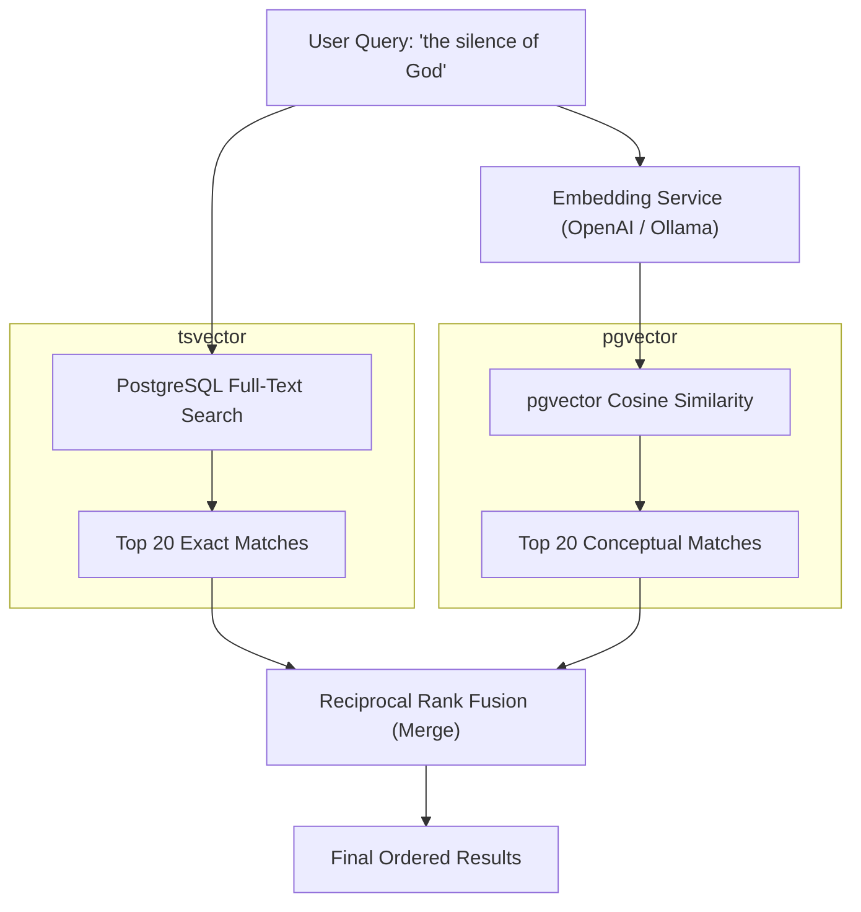
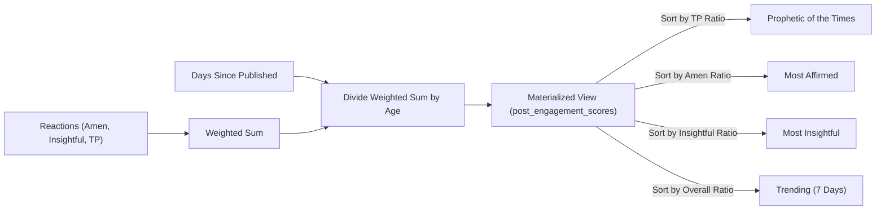

# Search & Recommendations System Implementation

This plan outlines the architecture and implementation steps for the new Search and Recommendations engine based on `scribes_searchRecommendation.md`. As requested, this document is designed to educate you on the foundational concepts before we dive into the code.

---

## 1. Foundation: The "Why" and "How"

### Keyword vs. Semantic Search
In traditional search (Keyword), the database looks for exact word matches. If a user searches for "the silence of God in suffering", the system looks for posts containing those exact words. 

**Think of it like** a strict librarian checking an index card catalog. If the card doesn't have the exact word you typed, you don't get the book.

However, language is nuanced. A post about "unanswered prayer" or "the dark night of the soul" might perfectly answer the user's query, but keyword search would miss it.

This is where **Semantic Search** comes in. By converting text into mathematical vectors (embeddings) using a model like OpenAI's `text-embedding-3-small` or `all-MiniLM`, we can plot the *meaning* of a post in a multidimensional space. 

**Think of it like** a wise mentor who understands what you *mean*, not just what you *say*. When you ask about "silence," they know "waiting" and "unanswered" are in the same neighborhood of meaning, so they pull those posts for you.

### Hybrid Search (Reciprocal Rank Fusion)
We don't want to choose between the two; we want both. 
**Think of it like** asking both the strict librarian and the wise mentor for their top 20 books. If they both recommend the same book, it gets pushed to the very top. This is called Reciprocal Rank Fusion (RRF). It perfectly balances finding exact matches (e.g., someone's specific name or a specific quote) with finding conceptually relevant posts.

### Engagement Velocity (Recommendations)
Traditional feeds often show the "Most Liked" posts of all time. This creates a rich-get-richer problem where old posts dominate the feed forever.

Instead, we use **Engagement Velocity**. 
**Think of it like** a speedometer for a post. We don't just look at how far the car has traveled (total likes); we look at how fast it's moving *right now*. We do this by taking the weighted engagement (Amen = 1.0, Insightful = 1.5, Thought-Provoking = 2.0) and dividing it by the *number of days since it was published*. A post with 50 reactions in 1 day is moving much faster than a post with 500 reactions in 2 years.

---

## 2. Architecture Diagrams

### Hybrid Search Flow

### Recommendation Velocity System

---

## 3. Drawbacks & Trade-offs (Clear over Clever)

While this approach is powerful, we must acknowledge the trade-offs of this "Clear over Clever" implementation:

1. **Materialized View Stale Data**: 
   - *The approach*: We use a `MATERIALIZED VIEW` to store engagement scores and refresh it periodically (e.g., every 6 hours).
   - *The trade-off*: Recommendations won't be real-time. If a post goes viral right this second, it won't appear in "Trending" until the next refresh. A complex, real-time event-streaming system (like Kafka) could solve this, but it would massively overcomplicate our current architecture. The periodic refresh is the simplest, most stable approach for V2.
2. **Asynchronous Embeddings**:
   - *The approach*: When a user publishes a post, we don't wait for the embedding to be generated. It gets queued for a background worker.
   - *The trade-off*: For the first few seconds (or minutes) of a post's life, it won't show up in *semantic* search results. However, it will immediately show up in *keyword* search results, mitigating the impact.

---

## 4. User Review Required

> [!IMPORTANT]  
> **Database Extension Requirements**
> This feature requires your PostgreSQL database to have the `pgvector` and `pg_trgm` extensions installed. If you are using a managed database provider (like Supabase or AWS RDS), these are usually available but might need to be explicitly enabled in your dashboard.

> [!WARNING]
> **Embedding Provider**
> The design supports either a local model (Ollama) or an API (OpenAI). For development, Ollama is free but requires you to run it locally. For production, OpenAI is recommended (it is extremely cheap, ~$0.01 per day at scale). Which would you like to default to for our `.env` setup right now?

---

## 5. Proposed Changes

### Database Layer
#### [NEW] `backend/internal/db/migration/014_search.up.sql`
- Enable `vector` and `pg_trgm` extensions.
- Add `embedding vector(768)` to `posts` table with an IVFFlat index.
- Create the `tags` and `post_tags` tables with the `upsert_tag` PL/pgSQL function.
- Create the `post_engagement_scores` Materialized View.
- Extend the `update_post_search_vector` trigger to include the title, content, and tags.

### Backend Application Layer
#### [NEW] `backend/internal/search/*`
- `embedding.go`: The interface for the embedding service and the implementations (OpenAI / Ollama / NoOp).
- `worker.go`: A background goroutine that listens for new posts and generates their embeddings asynchronously.
- `repository.go`: Contains the `HybridSearchPosts` SQL logic using RRF.
- `service.go` & `handler.go`: Exposes `GET /search`.

#### [NEW] `backend/internal/tag/*`
- `repository.go`: Executes the `upsert_tag` query.
- `service.go` & `handler.go`: Exposes `GET /tags/suggest` and `GET /tags/trending`.

#### [NEW] `backend/internal/recommendation/*`
- `repository.go`: Fetches recommendations based on the materialized view ratios.
- `service.go` & `handler.go`: Exposes the 4 named recommendation endpoints (Most Insightful, Most Affirmed, Prophetic, Trending) and Semantic "Similar" posts.

### Backend Main Wiring
#### [MODIFY] `backend/cmd/api/main.go`
- Wire up the new `search`, `tag`, and `recommendation` packages.
- Start the `searchWorker` goroutine.

### Frontend Application Layer (To be done iteratively after backend)
#### [NEW] `client/lib/features/search/*`
- UI for the new search screen, including trending tags on empty state and a debounced search input.
- Result cards that highlight keyword matches.

---

## 6. Verification Plan

### Automated Verification
- We will regenerate the SQLC models using Docker: `docker run --rm -v ${PWD}:/src -w /src kjconroy/sqlc generate`
- Ensure the backend compiles successfully after wiring the new packages.

### Manual Verification
- We will insert a test post and manually trigger the `upsert_tag` function to ensure tags are created and counted correctly.
- We will execute the `REFRESH MATERIALIZED VIEW post_engagement_scores` command and verify the sorting ratios (Amen, Insightful, TP, Overall) compute as expected.
